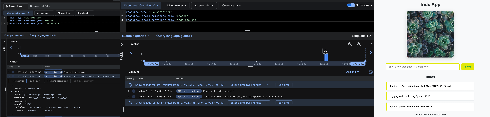
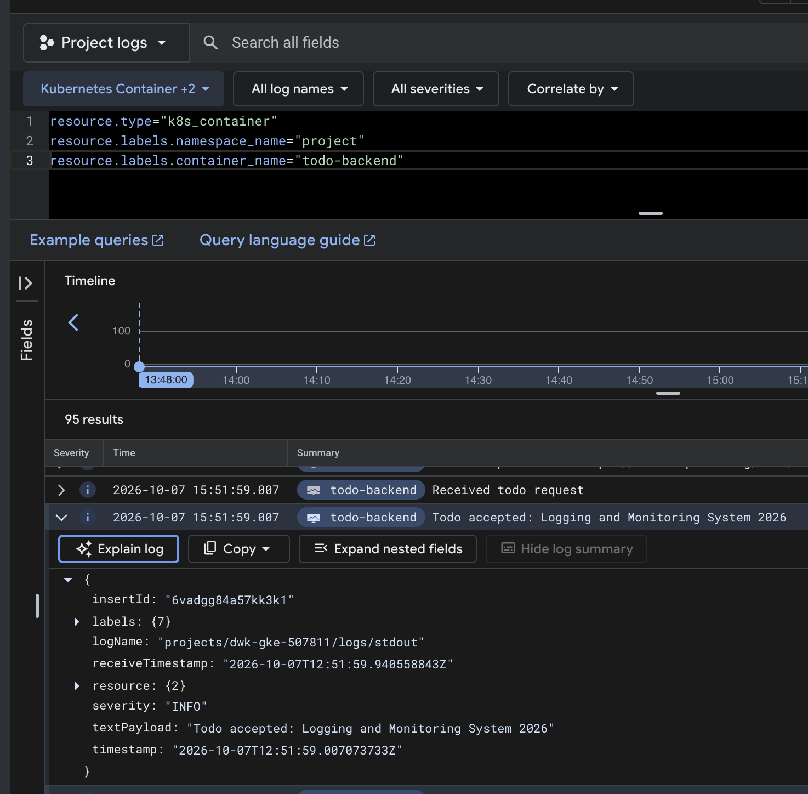
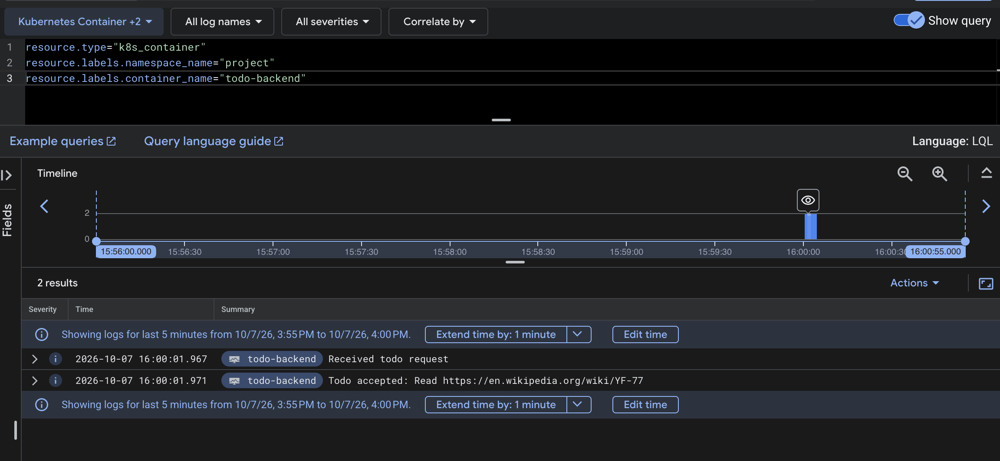
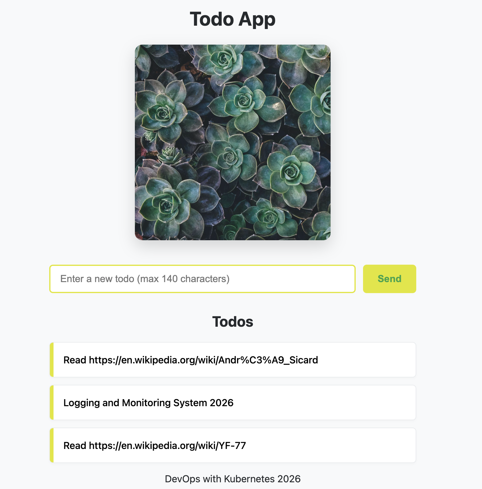

## 3.12. The project, step 20

- we will make necessary changes in our project manifests or wherever needed to deploy our project and resources in GKE
- We have already proper logging codes in our todo_backend/index.js so we after deploy, we will visit google cloud's logging and monitoring interface and create todo take screenshots from logging monitoring interface as they log.
- we remove nodePort: 30080 from todo-app.
- we exclude todo_backup from root kustomization.yaml as this exercise does not say anything about doing this.
- likewise, we will add `storageClassName: standard-rwo` in both todo_app/manifests/pvc.yaml and todo_backend/manifests/postgres.yaml altogether.
- we also add `project` namespace in the main kustomization.yaml this time so that all the deployed resources will rest there.
- run kustomize to test:

```sh
kubectl kustomize .
```

### create cluster:

- we need logging and monitoring enabled this time:

```sh
gcloud container clusters create dwk-cluster \
  --zone=europe-north1-b \
  --cluster-version=1.36.4-gke.2046000 \
  --disk-size=32 \
  --num-nodes=1 \
  --machine-type=e2-small \
  --logging=SYSTEM,WORKLOAD \
  --monitoring=SYSTEM
```

- we will only need application logs in monitoring/logging in google but not other like 'Prometheous'. We need `--logging=SYSTEM,WORKLOAD` and ` --monitoring=SYSTEM` while creating the cluster so we dont need to add them later.

### check current context:

```sh
kubectl config current-context
```

- then we apply:

```sh
kubectl apply -k .
```

- after applying, we can check pods like always:

```sh
kubectl get pods -n project
```

- the above gives our pods running:

```table
NAME                           READY   STATUS    RESTARTS   AGE
todo-app-766cdb6d9c-7429k      1/1     Running   0          2m11s
todo-backend-f45f49cb6-f8r8n   1/1     Running   0          2m11s
todo-postgres-0                1/1     Running   0          2m11s
```

- get service and its External IP:

```sh
kubectl get svc -n project
```

```table
NAME                TYPE           CLUSTER-IP       EXTERNAL-IP     PORT(S)          AGE
todo-app-svc        LoadBalancer   34.118.227.110   35.228.73.238   3000:31907/TCP   4m32s
todo-backend-svc    ClusterIP      34.118.237.64    <none>          3001/TCP         4m32s
todo-postgres-svc   ClusterIP      34.118.236.204   <none>          5432/TCP         4m32s
```

- like always, lets connect into the todo-postgres-0 and create a 'todos' table:

```sh
kubectl exec -it todo-postgres-0 -n project -- psql -U postgres
```

```sql
CREATE TABLE todos (
    id SERIAL PRIMARY KEY,
    todo TEXT NOT NULL
);
```

- verify frontend `http://35.228.73.238:3000/` is up and running.
- frontend does not yet contain wiki links, so lets run the one-time job and generate links. Since our cronjob is scheduled for 24 hours we cannot wait.
- check cronjobs in project namespace:

```sh
kubectl get cronjobs -n project
```

```table
NAME             SCHEDULE    TIMEZONE   SUSPEND   ACTIVE   LAST SCHEDULE   AGE
todo-generator   0 * * * *   <none>     False     0        <none>          16m
```

- then create and run one time cronjob:

```sh
kubectl create job one-time-todo-cronjob \
  --from=cronjob/todo-generator \
  -n project
```

- again, lets check cronjobs

```sh
kubectl get jobs -n project
```

```table
NAME                    STATUS     COMPLETIONS   DURATION   AGE
one-time-todo-cronjob   Complete   1/1           6s         18s
```

- now the frontend is showing wiki link also.

### Monitoring and logging in google cloud:

- in log explorer for project: dwk-gke...
- come back hdre--------------------------------------------------

### delete all resources:

```sh
kubectl delete job one-time-todo-cronjob -n project
```

```sh
gcloud container clusters delete dwk-cluster \
  --zone=europe-north1-b \
  --project=dwk-gke-507811
```

# Logging and Monitoring Screen Shot:





