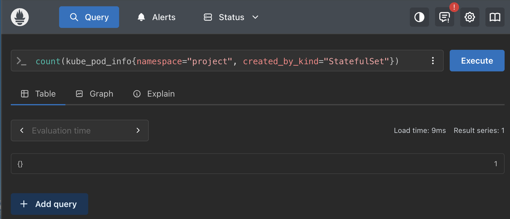

## 4.3. Prometheus

- create a separate `monitoring` namespace and install Prometheus using Helm.

```sh
kubectl create namespace monitoring
```

- we need to add Prometheus Helm repository, to save repository configuration in Helm's local setting with the following command:`helm repo add prometheus-community https://prometheus-community.github.io/helm-charts`
  however, before that I had already done so in previous exercise so I want to check repo list: `helm repo list` and I can clearly find prometheus-community and Grafana also:

```table
NAME                    URL
grafana                 https://grafana.github.io/helm-charts
prometheus-community    https://prometheus-community.github.io/helm-charts
```

- then let Helm refresh its local list of available chart versions, so it can find the latest chart information from the configured repositories:

```sh
helm repo update
```

- Update Complete. ⎈Happy Helming!⎈
- then install Prometheus into previously created `monitoring` namespace, using the existing `prom-values.yaml` file

```sh
helm install prometheus prometheus-community/prometheus \
  --namespace monitoring \
  --values ex_4.3/todo_backend/monitoring/prom-values.yaml
```

- check the Promethus services

```sh
kubectl get services -n monitoring
```

- port forward Promethus port to access from localhost:9090:

```sh
kubectl port-forward -n monitoring svc/prometheus-server 9090:80
```

- promethus UI is up and running: `http://localhost:9090/query`
- in the Promethus UI we can use PromQL( Promotheus query language) to query our kubernetes resources. For now we can just query pod info:`kube_pod_info`
- we can quickly query for StatefulSets in our previous `project`namespace:

```sh
kube_pod_info{namespace="project", created_by_kind="StatefulSet"}
```

- the above prints pod information for todo-postgres:
  `kube_pod_info{app_kubernetes_io_component="metrics", app_kubernetes_io_instance="prometheus", app_kubernetes_io_managed_by="Helm", app_kubernetes_io_name="kube-state-metrics", app_kubernetes_io_part_of="kube-state-metrics", app_kubernetes_io_version="2.20.0", created_by_kind="StatefulSet", created_by_name="todo-postgres", helm_sh_chart="kube-state-metrics-8.6.0", host_ip="172.18.0.3", host_network="false", instance="10.42.3.155:8080", job="kubernetes-service-endpoints", namespace="project", node="k3d-k3s-default-server-0", pod="todo-postgres-0", pod_ip="10.42.1.112", service="prometheus-kube-state-metrics", uid="13bd7985-b49a-4bf4-b4df-5cf50f11b0a1"}`
- the exercise talks about `promotheus`namespace which I don't have or have never created before in my memory. However, in my earlier exercise 4.2, I have created `project` namespace that contains both `StatefulSets`as well `ReplicaSets`.
- For this exercise, I will work on `project`namespace with `StatefulSets`which contains todo-postgres as shown above.
- count of StatefulSet in project namespace query results like:

```sh
count(kube_pod_info{namespace="project", created_by_kind="StatefulSet"})
```

- above query output:
  `{} 1`
- Hence, i successfully installed Prometheus with Helm, accessed it UI through kubernetes sercice using port-forwarding technique and prepared a query to search the numbers of pods running in project namespace.


